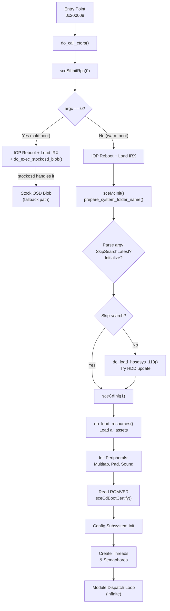
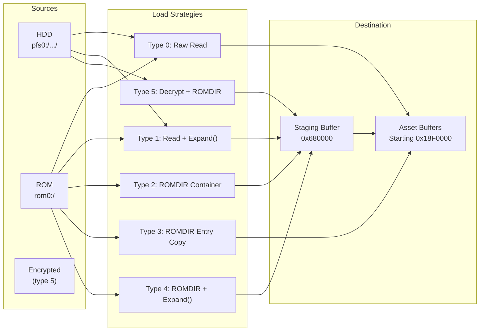
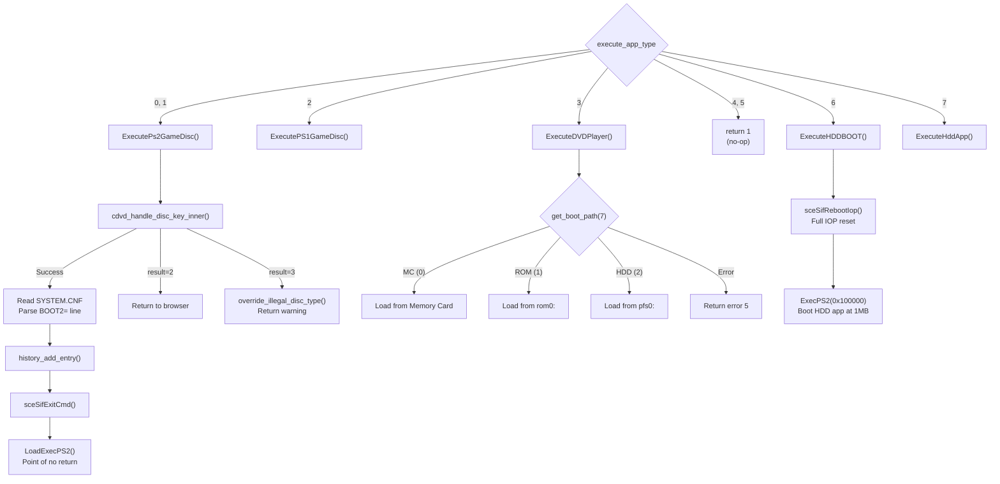

# Boot Pipeline & Initialization

> The complete boot sequence of the PS2 HDDOSD (CrystalOSD target binary), from the `main()` entry point to the infinite module dispatch loop, including application launch logic.

## Boot Sequence Overview

The OSDSYS `main()` at `0x0020d4d0` is a 429-line monolith (921 instructions) that orchestrates the entire system boot. It runs in 5 sequential phases before entering the infinite module dispatch loop.



## Phase 1: IOP Reset & Module Loading

The IOP (I/O Processor) is rebooted with a custom image (`osdrp_img`) and 8 IRX modules are loaded:

| # | IRX Module | Address Range | Purpose |
|---|-----------|--------------|---------|
| 1 | `usbd.irx` | `0x5A33D0–0x5AAA9D` | USB host driver |
| 2 | `usbkbd.irx` | `0x5AAAA0–0x5ADCB5` | USB keyboard driver |
| 3 | `subfile.irx` | `0x5ADCC0–0x5AE82D` | Sub-file I/O |
| 4 | `dev9.irx` | `0x58A0B0–0x58CD75` | DEV9 expansion bay (HDD/Network) |
| 5 | `atad.irx` | `0x58CD80–0x58FBFD` | ATA device driver (HDD) |
| 6 | `hdd.irx` | `0x58FC00–0x59706D` | HDD filesystem layer |
| 7 | `pfs.irx` | `0x597070–0x5A33CD` | PFS (PlayStation File System) |
| 8 | `rmman2.irx` | `0x50A780–0x50B7F5` | Remote manager (IR remote) |

After loading, it checks for `rom0:ADDDRV` and loads it if present. On cold boot (`argc == 0`), `do_exec_stockosd_blob()` is called — this boots the stock OSD via IOP as a fallback.

## Phase 2: Filesystem & Configuration

```text
sceMcInit()                      → Memory card subsystem
prepare_system_folder_name()     → Build "hdd0:__system" path
sceMount("pfs0:", "hdd0:__system") → Mount HDD system partition
```

**Argument parsing** scans `argv` for:
- `SkipSearchLatest` → skip `do_load_hosdsys_110()` (HDD update search)
- `Initialize` → force OOBE (first-time setup, sets `oobe_forced = 1`)

`do_load_hosdsys_110()` checks if a newer HOSDSYS exists on HDD at `hdd0:__system/pfs/osd110/hosdsys.elf`. If found, it reboots into that ELF via `sceSimulKLoadExec()`.

## Phase 3: Resource Loading Pipeline

`do_load_resources()` at `0x0020AB98` (548 lines) loads all graphical and audio assets. It iterates through `osdsys_resource_info[]`.



The encryption used in type 5 resources is a 16-round block cipher with XOR keys derived from `DAT_002AD978` and `DAT_002AD970`.

After loading resources, the system initializes peripherals:
```text
sceMtapInit() + sceMtapPortOpen(0–3)  → Multitap (4 ports)
Rm2Init(0)                             → Remote control manager
scePadInit(0)                          → Gamepad subsystem
sound_init()                           → SPU2 via IOP RPC
```

## Phase 4 & 5: Thread Infrastructure & Dispatch Loop

After hardware init, `main()` creates the thread and semaphore infrastructure, then drops its priority to 30 and enters an infinite dispatch loop.

```c
// Pseudocode of the main dispatch loop
while (true) {
    if (execute_app_type != -1) {
        result = Game_Boot_ExecuteDisc(argc, argv);
        execute_app_type = -1;
    }
    
    graph_reset_related1();
    FlushCache(2);
    
    // Wake the module's thread based on var_current_module
    thread_id = module_table[var_current_module - 1];
    WakeupThread(thread_id);
    WaitSema(moduleFinishSema);  // Block until module signals done
}
```

## Application Launch Pipeline (Game Boot)

`Game_Boot_ExecuteDisc_p5_tgt()` at `0x00208000` is the central dispatcher for launching applications. It's called from the main loop whenever `execute_app_type != -1`.



### PS2 Game Boot Sequence

1. **Disc key validation**: `cdvd_handle_disc_key_inner()` authenticates the disc via MagicGate.
2. **SYSTEM.CNF parsing**: Reads `cdrom0:\SYSTEM.CNF`, extracts `BOOT2=` path (the game's ELF).
3. **HDD network check**: Compares disc ID against `SLPS-25050` (a known HDD-enabled title) and checks for `NIC`/`NICHDD` config keys to decide whether to idle-poweroff the HDD.
4. **History logging**: `history_add_entry()` records the disc ID in play history.
5. **LoadExecPS2**: Replaces the running ELF with the game's ELF — this never returns.

### DVD Player Boot Sources

The DVD player ELF is searched in 3 locations (priority order):

| Priority | Source | Path | Notes |
|----------|--------|------|-------|
| 0 | Memory Card | `mc0:/BADATA-SYSTEM/dvdplayer.elf` | User-installed update |
| 1 | ROM | `rom0:DVDPLAYER` | BIOS built-in |
| 2 | HDD | `hdd0:__system/pfs/dvdplayer/` | HDD utility disc |

### HDD Boot (`ExecuteHDDBOOT`)

The most aggressive boot path — fully reboots IOP with `sceSifRebootIop()`, then calls `ExecPS2()` to jump to the HDD application loaded at `0x100000`. This is used for HDD-based apps like the BB Navigator.
