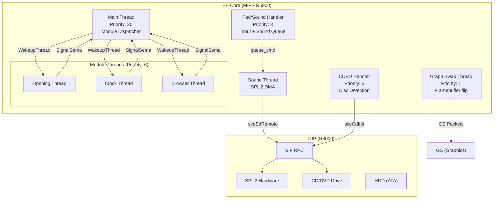
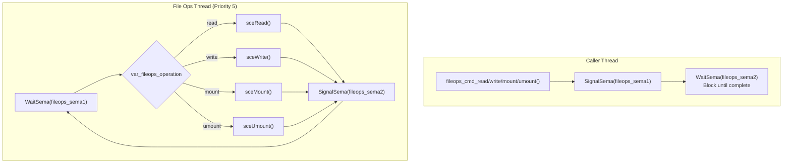

# Thread & Synchronization Architecture

> Detailed mapping of the EE core threads, synchronization semaphores, async file I/O framework, and callback queues.

## Complete Thread Priority Map

```text
Priority 1  ████████████████████████████████  Graph Swap (framebuffer flip)
Priority 3  ████████████████████████████      Pad/Sound Handler (input+audio)  
Priority 5  ██████████████████████████        CDVD Handler / File Ops
Priority 6  ████████████████████████          Module Threads (Opening/Clock/Browser)
Priority 30 ████████████                      Main Thread (module dispatcher)
Priority 40 ████████                          Callback Queue (deferred ops)
```

Lower number = higher priority. The design ensures:
- **Framebuffer flips** never miss VSync (priority 1).
- **Input** is always responsive (priority 3).
- **Disc detection** and I/O run before UI logic (priority 5).
- **UI modules** consume the bulk of idle CPU time (priority 6).
- **Main dispatcher** only runs when modules yield (priority 30).
- **Deferred callbacks** execute when nothing else needs CPU (priority 40).

## Core Thread Architecture



## Hardware Synchronization Semaphores

### Rendering Semaphore Chain
The Graph Swap thread (`priority 1`) ensures framebuffer flips happen instantly without tearing.

| Semaphore | Signaled By | Waited By | Purpose |
|-----------|------------|-----------|---------|
| `swapSema` | Module thread | Graph swap thread | "Frame ready to display" |
| `drawStartSema` | Graph swap thread | Module thread | "Buffer swapped, draw next" |
| `drawEndSema` | VBlank handler | Module thread | "GS finished drawing" |
| `waitFrameSema` | VBlank handler | `OpeningDoWaitNextFrame()` | "VSync occurred" |

### Main Execution Semaphores
| Semaphore | Signaled By | Waited By | Purpose |
|-----------|------------|-----------|---------|
| `moduleFinishSema` | Any Module Thread | Main Dispatcher | Signals that the module has finished its work (e.g., transition triggered) |

## File Operations Framework

The `fileops` subsystem provides async file I/O via a dedicated thread (`Priority 5`), managing up to 5 concurrent Memory Card slots and 3 HDD file handles.



### File Handle Pools
| Pool | Count | Purpose |
|------|-------|---------|
| MC Slots | 5 | `mc0:/BADATA-SYSTEM/`, `mc1:/`, etc. |
| HDD Slots | 3 | `pfs0:`, `pfs1:`, partition mounts |

Each slot maintains: a file descriptor, operation state, last error code, and a 48-byte path buffer.

## Callback Queue System

The callback queue (`callback_queue_prepare`) provides deferred execution for operations that cannot safely run inside an interrupt context.

```text
callback_queue_thread (Priority 40, Stack 16KB)
  └─ WaitSema(unksema_396944)
     └─ Execute queued callback
     └─ SignalSema(unksema_396948)
```

This is used heavily for HDD operations triggered from CDVD interrupts. Since `sceCdPOffCallback` fires inside a hardware interrupt, it queues the power-off work for this thread instead of blocking the EE core.
