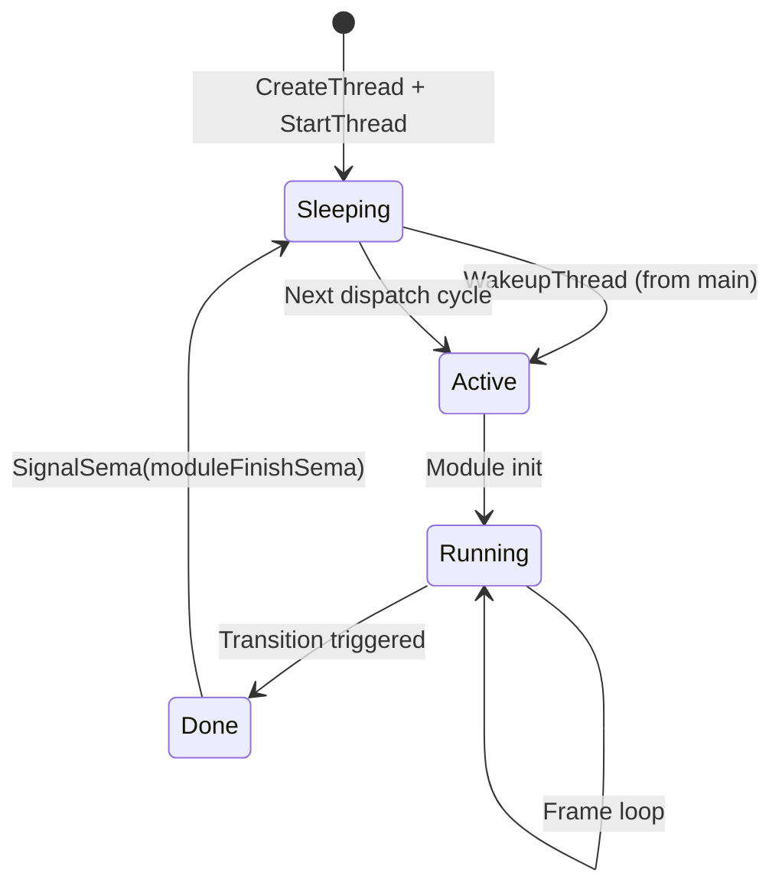
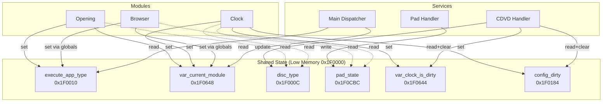
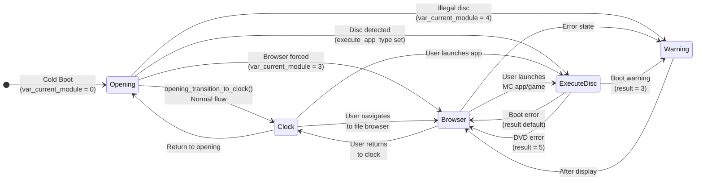
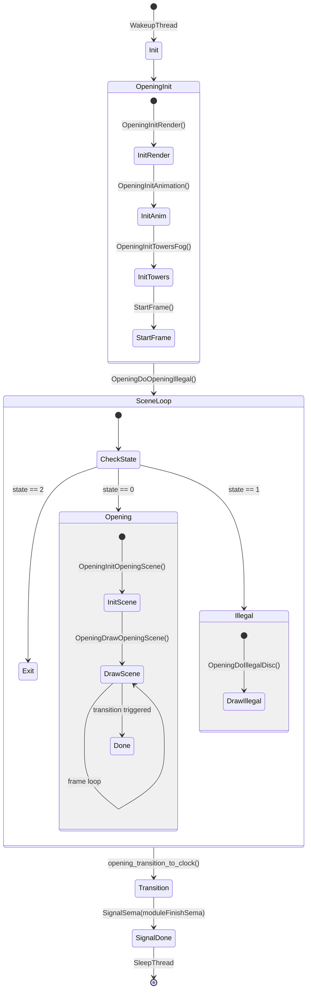

# Module System Architecture

> Details the dynamic VTable-based module loading system, the individual module lifecycles, and the complex state machine dictating transitions between them.

## Module Registration (VTable)

Each UI module follows a VTable pattern registered via `FUN_00208408()` / `FUN_00208450()`:

```c
typedef struct {
    void* (*prepare)(void);    // Create thread, return thread_id
    void* reserved;
    char* (*getdesc)(void);    // Human-readable name
    char* (*getversion)(void); // Version string
    char* (*option_str)(void); // Optional: boot option string
    void* (*pathrelated)(void);// Optional: path resolver
    void* reserved2;
} ModuleVtable;
```

### Registered Modules

| Index | Module | Setup Address | Prepare | Thread Proc |
|-------|--------|--------------|---------|-------------|
| 0 | Opening | `0x0021AB38` | `module_opening_prepare` | `module_opening_thread_proc` |
| 1 | Clock | `0x00225900` | `module_clock_prepare` | `module_clock_thread_proc` |
| 2 | Browser | `0x0024E840` | `module_browser_prepare` | `module_browser_thread_proc` |
| 3 | Machine | `0x00209438` | `module_machine_prepare` | (inline) |
| 4 | CD Player | `0x00209790` | `module_cdplayer_prepare` | (inline) |
| 5 | PS1DRV | `0x00209DE0` | `module_ps1drv_prepare` | (inline) |
| 6 | DVD Player | `0x0020A780` | `module_dvdplayer_prepare` | (inline) |
| 7 | SMAP | `0x0020A938` | `module_smap_prepare` | (inline) |

## The `var_current_module` State

The main loop utilizes `var_current_module` (at `0x1F0648`) to decide which thread to wake up.

| Value | Target |
|-------|--------|
| 0 | Opening (boot animation) |
| 1 | Opening (replay) |
| 2 | Clock/Settings |
| 3 | Browser (memory card) |
| 4 | Warning/Illegal disc screen |
| 5 | CD Player (HDD app launch) |

## Module Lifecycle

Each UI module (Opening, Clock, Browser) strictly follows the same sleeping/waking lifecycle:



## Cross-Module Communication

Communication occurs entirely through shared global variables located in the `0x1F0000` (low memory) region. There are no message queues or direct RPCs between modules.



## Module Transitions

Transitions are governed by `opening_transition_to_clock()` and user actions in the Clock/Browser.



### Disc Type → `execute_app_type` Mapping
From `opening_transition_to_clock()`:

| `DAT_003700A0` | Disc Type | `execute_app_type` |
|----------------|-----------|-------------------|
| `0x6A`, `0x6B` | DVD Video | 2 |
| `0x6C`, `0x6D` | PS1 Disc | 1 |
| `0x6E` | PS2 Disc | 0 |
| `0x6F` | CD Player | 5 |
| `0x70` | Warning | 4 |
| `0x73` | CDDA | 3 |

## Opening Animation Engine Details

The Opening module renders the PS2 boot sequence: crystalline towers, fog, and floating lights. It operates via a two-level state machine.

| Variable | Address | Purpose |
|----------|---------|---------|
| `DAT_00370004` | Current state | 0=Opening, 1=Illegal, 2=Exit |
| `DAT_00370008` | Next state | Written to trigger transitions |
| `DAT_0037000C` | Initial state | Copied to both on init |
| `DAT_00370010` | Sub-state | 0=InitScene, 1=Drawing, 2=Done |


