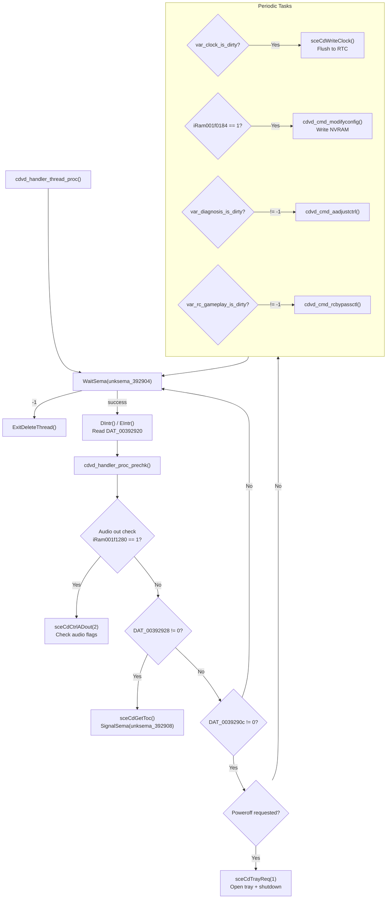

# CDVD State Machine

> Analyzes the `cdvd_handler_thread_proc` responsible for CD/DVD drive polling, disc detection, and hardware NVRAM/RTC writes.

## The CDVD Handler Thread

The CDVD handler thread (`cdvd_handler_thread_proc`) runs continuously at **priority 5**. It is responsible for polling the disc tray status and processing hardware config writes requested by UI modules.

## Dirty Flags and Hardware Synchronization

The CDVD thread is the *only* thread in the OSDSYS that writes directly to the hardware NVRAM and RTC via SIF RPC. The UI modules (like the Clock) do not execute RPC calls directly; instead, they set "dirty" flags in the `0x1F0000` low-memory region. 

The CDVD thread checks these flags periodically and executes the actual hardware writes:

| Flag Variable | Address | Written By | Action Executed by CDVD |
|---------------|---------|-----------|------------------------|
| `var_clock_is_dirty` | `0x1F0644` | Clock module | `sceCdWriteClock()` → RTC Update |
| `iRam001f0184` | `0x1F0184` | Config module | `cdvd_cmd_modifyconfig()` → Mechacon NVRAM |
| `var_diagnosis_is_dirty` | `0x1F1284` | Clock settings | `cdvd_cmd_aadjustctrl()` |
| `var_rc_gameplay_is_dirty` | `0x1F1288` | Clock settings | `cdvd_cmd_rcbypassctl()` |

The periodic idle check runs every `0x3C` (60) semaphore cycles. If no configuration is dirty and the system is idle, it calls `FUN_00200FC0()` (likely triggering HDD standby/spindown).
