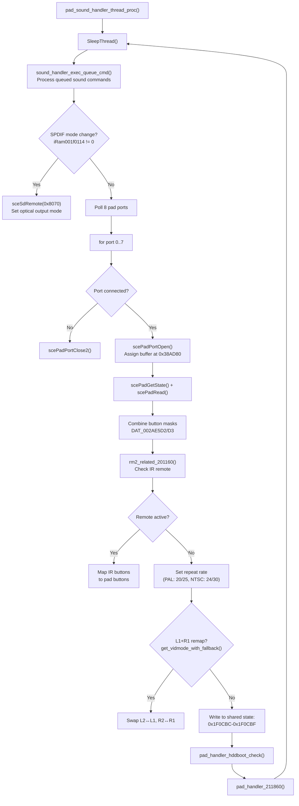
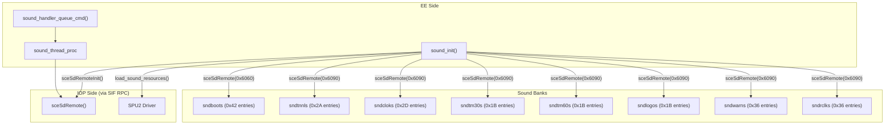

# Pad Input & Sound Subsystem

> Details the `pad_sound_handler_thread_proc` responsible for polling controllers, IR remotes, and managing the audio queue for the SPU2.

## Input Handling System

The `pad_sound_handler_thread_proc` runs at **priority 3** (every VBlank), polling all 8 pad ports (Multitap included) and the IR remote.

## Input Data Format (Shared Memory)

The final parsed pad state is written to shared memory at `0x1F0CBC`, where the UI modules read it.

| Offset | Size | Content |
|--------|------|---------|
| `0x1F0CBC` | 1 | `DAT_002AE5D0` — pad mode |
| `0x1F0CBD` | 1 | `DAT_002AE5D1` — pad ID |
| `0x1F0CBE` | 1 | Button mask high (inverted: 0=pressed) |
| `0x1F0CBF` | 1 | Button mask low (inverted: 0=pressed) |
| `0x1F0CDC` | 4 | Input type (0=none, 6=pad/remote) |

## PAL vs NTSC Key Timing

Because the pad polling is tied to the VBlank rate, the OSDSYS uses different frame counters for key-repeat rates to maintain identical physical timings across 50Hz and 60Hz regions:

| Parameter | NTSC (60Hz) | PAL (50Hz) |
|-----------|------|-----|
| Key repeat start | 24 frames | 20 frames |
| Key repeat rate | 30 frames | 25 frames |
| Remote repeat start | 38 frames | 31 frames |
| Remote repeat rate | 54 frames | 45 frames |

---

## Sound Subsystem

The sound system handles audio queue commands pushed from the UI modules.

The system uses 8 sound banks loaded into IOP memory via `sceSdRemote()`. Each bank contains sequenced audio data. The `sndosddh` bank at offset `0x6000` handles the signature OSDSYS ambient drone sound.
