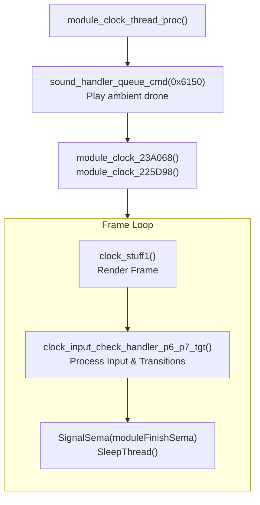
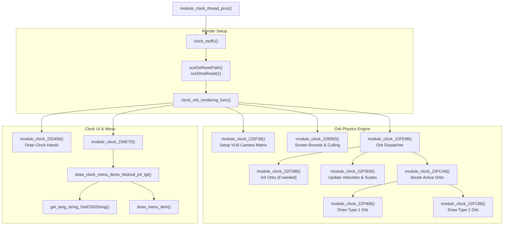
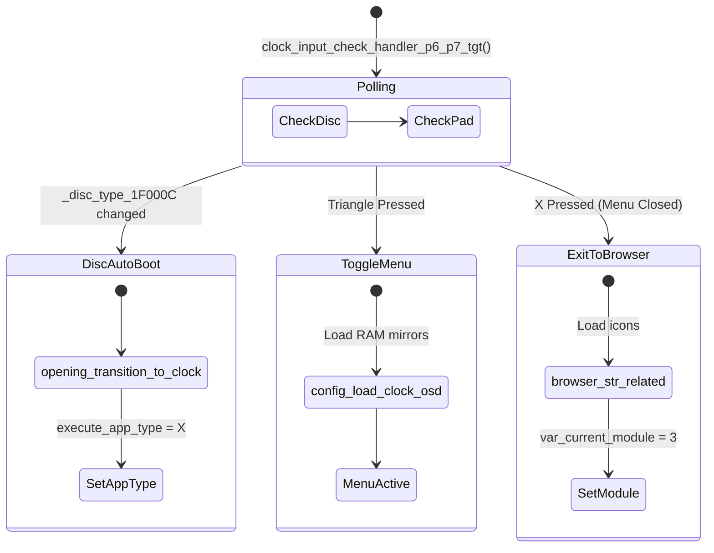
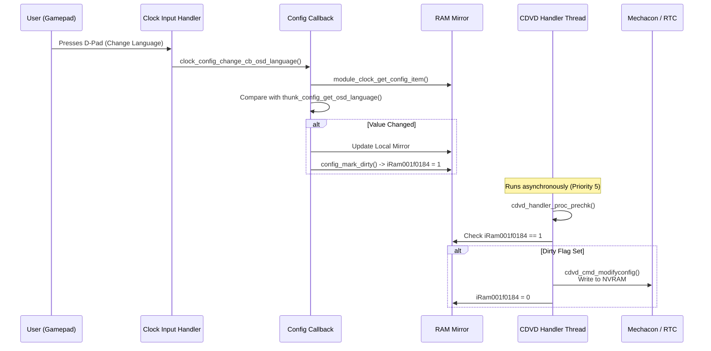

# Clock Module: Engine & Physics

> A deep dive into the inner workings of the `module_clock` subsystem, focusing on its 3D rendering pipeline, the physics simulation of the background glass orbs, and how it handles user input and configuration synchronization.

## 1. Clock Module Overview

The Clock module is the default "idle" state of the PS2. When the user drops out of the Opening animation or exits the Browser, the system transitions here. The module operates entirely inside `module_clock_thread_proc` (Priority 6).

## 2. The Rendering Pipeline (Graphics & Physics)

The Clock module runs at 60 FPS (NTSC) or 50 FPS (PAL), synchronized to the VBlank interrupt. The entire visual state of the module is driven by a hierarchy of math subroutines.

## 3. The Floating Orbs (Physics Simulation)

The background of the clock screen features 12 floating, transparent spheres. These "orbs" are rendered using VU0 macro mode and feature complex collision and refraction physics.

### Physics State
The state of the 12 orbs is updated continuously by `module_clock_22F5D0()`. The system tracks 12 physical entities stored in a contiguous array in the `0x00404000` memory region.

| Property | Size | Description |
|----------|------|-------------|
| ID | 4 bytes | Index 0–11 |
| Position | 16 bytes (vec4) | Current 3D position `(x, y, z, w)` |
| Velocity | 16 bytes (vec4) | Current momentum |
| Rotation | 16 bytes (vec4) | Spin matrix components |
| Scale | 4 bytes | Size of the orb |

The update loop applies velocity vectors, handles screen-edge boundary collisions (bouncing), and applies scaling rules:
*   **Focus Orb** (index 0): Scaled to `0x43480000` (200.0f).
*   **Background Orbs**: Scaled to `0x43200000` (160.0f).

### Refraction rendering
Because the PS2 lacks programmable pixel shaders, the "glass" refraction effect of the orbs is achieved using **environment mapping**. The VU1 calculates UV coordinates based on the vertex normal reflected against the camera vector, mapping a blurry environment texture onto the spheres to simulate light bending.

## 4. Input & Transitions

The input polling and transition logic lives in `clock_input_check_handler_p6_p7_tgt()`.

*   **Disc Auto-Boot**: If a disc is inserted, the CDVD Handler updates `_disc_type_1F000C`. The Clock module detects this change, breaks its render loop, and signals the main dispatcher to boot the disc.
*   **Browser Transition**: Pressing `X` initiates a transition to the Browser module by setting `var_current_module = 3`.

## 5. Configuration Sync Pipeline

When the user changes a setting in the Clock menu, the Clock module does **not** write to the NVRAM directly. It uses an asynchronous sync pipeline.

This asynchronous design ensures that the GS rendering loop (Clock thread) never blocks waiting for slow I2C bus communications with the RTC or EEPROM chips.

### Time Change & BCD
If the user alters the time/date, the callback `config_item_change_cb_clock_write_mechacon` converts the UI's decimal values into **BCD (Binary-Coded Decimal)** format. It stages this buffer and sets `_var_clock_is_dirty = 1`, prompting the CDVD thread to execute `sceCdWriteClock`.
