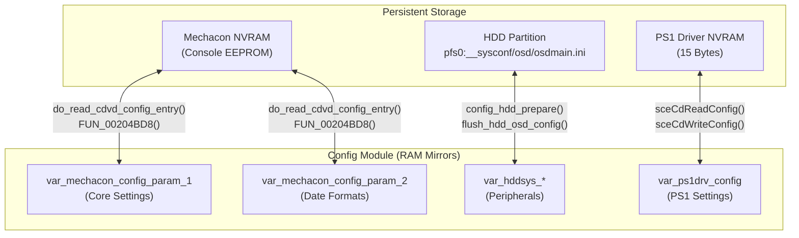

# OSDSYS Architecture — Part 6: Configuration Subsystem

> Deep dive into the OSDSYS Configuration module (`src/config/`). This subsystem is responsible for abstracting the hardware NVRAM (EEPROM) and HDD `__sysconf` partition, providing a unified getter/setter interface for the rest of the OS, and managing the synchronization between volatile RAM and persistent storage.

---

## 1. Storage Layers

The OSDSYS manages configuration across three distinct persistent storage layers, all abstracted by the `config` module.



---

## 2. The Mechacon Parameters

The core settings of the PS2 (Language, Video Output, Aspect Ratio, Timezone) are packed into two 32-bit integers stored in the Mechacon (the PS2's security and IO coprocessor) NVRAM.

### `var_mechacon_config_param_1` (32-bit Bitfield)

This is the most critical configuration variable in the entire OS. Every bit is tightly packed to save EEPROM space.

| Bit Range | Size | Property | Values |
| :--- | :--- | :--- | :--- |
| **0** | 1 bit | SPDIF Mode | `0` = PCM, `1` = Bitstream |
| **1:2** | 2 bits | Aspect Ratio | `0` = 4:3, `1` = Full, `2` = 16:9 |
| **3** | 1 bit | Video Output | `0` = YCbCr (Component), `1` = RGB |
| **4:8** | 5 bits | OSD Language | `0` = Japanese, `1` = English, `2` = French, `3` = Spanish, `4` = German, `5` = Italian, `6` = Dutch, `7` = Portuguese |
| **9:19** | 11 bits| Timezone Offset | Signed integer (minutes / 30). Used to calculate global rotation of the 3D clock world. |
| **20:28** | 9 bits | *Unknown/Reserved* | Used internally by the kernel or unused. |
| **29** | 1 bit | Daylight Saving | `0` = Standard Time, `1` = Summer Time |
| **30** | 1 bit | Time Format | `0` = 24 Hour, `1` = 12 Hour |
| **31** | 1 bit | Init Flag | Flips when defaults are set. |

**Getter/Setter API:**
The `config` module provides dedicated functions (e.g., `config_get_aspect_ratio`, `config_set_osd_language`) that perform bitwise masking and shifting (`&`, `|`, `<<`, `>>`) against this global variable.

---

## 3. HDD Peripheral Configuration (`__sysconf`)

Unlike the core NVRAM, which is limited in space, the PS2 Broadband Navigator (BB Navigator) and HDD utility discs introduced extended configurations stored on the hard drive. 

When the system boots and detects an HDD, `config_hdd_prepare()` is called. It parses `pfs0:__sysconf/osd/osdmain.ini` and populates the following global variables:

*   **Keyboard (`var_hddsys_keyboard_*`)**: USB Keyboard layout type (QWERTY, etc.), repeat rate, and delay.
*   **Mouse (`var_hddsys_mouse_*`)**: USB Mouse speed, double-click speed, and left/right-handed mode.
*   **IME/ATOK (`var_hddsys_atok_*`)**: Japanese text input method configurations.
*   **Soft Keyboard (`var_hddsys_softkb_*`)**: Virtual keyboard preferences.

If the `.ini` file is missing or unreadable, `config_hdd_set_default()` falls back to hardcoded defaults (e.g., QWERTY, standard mouse speed).

---

## 4. Hardware Read/Write Operations

Because the NVRAM resides on the Mechacon, reading and writing to it requires RPC (Remote Procedure Calls) to the IOP (I/O Processor).

### Reading (`do_read_cdvd_config_entry`)
When the system boots, `config_mechacon_prepare()` calls `do_read_cdvd_config_entry()`.
This function uses the PS2SDK equivalent functions:
1.  `sceCdOpenConfig(1, 0, 2, buf)` — Opens block 1 of the NVRAM.
2.  `sceCdReadConfig(buffer, status)` — Copies the NVRAM into EE memory.
3.  `sceCdCloseConfig(status)` — Closes the RPC stream.

*(Note: It uses a `while ((status & 0x81) != 0)` loop to ensure the CDVD hardware is ready before proceeding).*

### Writing (`write_osd_config`)
When the user finishes modifying settings in the Clock menu, they do not write to NVRAM immediately. Instead, they call `write_osd_config()`.
1.  It synchronizes the 15-byte `var_ps1drv_config`.
2.  It sends the 32-bit `var_mechacon_config_param_1` to the CDVD thread via `FUN_00204BD8`.
3.  It calls `set_osd_config_to_eekernel()` so that the running EE Kernel is aware of the new language/timezone settings.
4.  It calls `flush_hdd_osd_config()` to update `osdmain.ini` on the hard drive.

---

## 5. Factory Defaults

If the system detects that the NVRAM is corrupt or uninitialized (e.g., first boot out of the box), `config_set_default_main()` is invoked.

It forcefully overwrites the configuration with safe defaults for every single tracked variable in the system:

```c
void config_set_default_main(void)
{
    // Sets the 32-bit param to 0x03343800 while preserving the 31st Init bit.
    // Breaks down to:
    // - Time format: 12-hour (Bit 30)
    // - DST: Off (Bit 29)
    // - Timezone: UTC (Bits 9-19)
    // - Language: English (Bits 4-8 = 1)
    // - Video: YCbCr Component (Bit 3 = 0)
    // - Aspect: 4:3 (Bits 1-2 = 0)
    // - SPDIF: PCM (Bit 0 = 0)
    var_mechacon_config_param_1 = (var_mechacon_config_param_1 & 0x80000000) | 0x03343800;
    
    // Clear the specific unknown flag at DAT_0037181c
    DAT_0037181c = DAT_0037181c & 0xfffffffc;

    // Reset all HDD / Peripheral configurations to base values:
    
    // Virtual Keyboard (On-Screen Keyboard)
    var_hddsys_softkb_onoff = 1;         // 1 = Enabled
    var_hddsys_softkb_qwert = 0;         // 0 = Standard Layout (not QWERTY)
    
    // Physical USB Keyboard
    var_hddsys_keyboard_type = 0;        // 0 = Japanese / Standard Layout
    var_hddsys_keyboard_repeatw = 1;     // 1 = Standard Repeat Wait (Delay before repeat)
    var_hddsys_keyboard_repeats = 1;     // 1 = Standard Repeat Speed
    
    // Physical USB Mouse
    var_hddsys_mouse_speed = 1;          // 1 = Standard Pointer Speed
    var_hddsys_mouse_dblclk = 1;         // 1 = Standard Double Click Interval
    var_hddsys_mouse_lr = 1;             // 1 = Right-Handed (Standard Button Mapping)
    
    // IME / Japanese Input (ATOK)
    var_hddsys_atok_mode = 0;            // 0 = Romaji Input Mode
    var_hddsys_atok_bind = 1;            // 1 = Standard Key Binding
}
```

Every peripheral attribute tied to the Hard Disk Drive's configuration is explicitly reset to `0` or `1` by this routine, ensuring that no uninitialized memory causes anomalous behavior in the typing interface or cursor movement logic.
