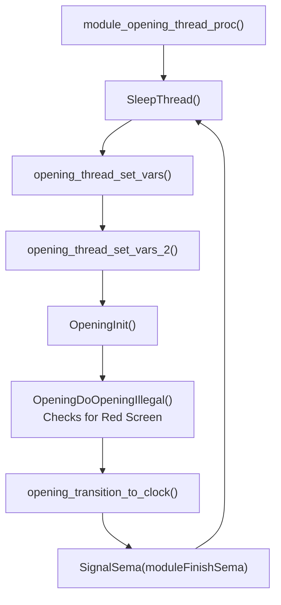

# Opening Module: Engine & State Machine

> Analyzes the main thread loop, the camera state machine, and the Red Screen of Death (RSOD) rendering of the PS2 Opening Module.

---

## 1. The Main Thread (`module_opening_thread_proc`)

The Opening Module operates as a continuous finite state machine. The main thread runs at Priority 6 and executes the following frame loop:



---

## 2. Camera & Animation States (`OpeningProcessInner`)

The visual progression of the boot sequence—from floating in the clouds to diving into the towers—is controlled by `OpeningProcessInner`. It uses a master state variable (`DAT_003db850`) to track the animation phase.

| State | Name | Description |
|-------|------|-------------|
| **0** | **Init** | Initializes camera vectors and physics arrays. |
| **1** | **Cloud Hover** | The camera floats above the clouds. It waits here indefinitely if no disc is inserted, until the timeout triggers the Clock module. |
| **2** | **Disc Detected** | Triggered when `_disc_type_1F000C` indicates a valid PS1 or PS2 disc. The camera prepares to dive. |
| **3-5** | **Acceleration** | The camera applies velocity multipliers (`DAT_003db810` etc.) to begin falling towards the towers. |
| **6** | **The Dive** | The camera breaches the cloud layer and falls into the darkness between the towers. At the bottom of the dive, it issues the SPU2 command (`0x6150`) to play the game boot sound ("swoosh"). |
| **7** | **Exit** | The animation completes, yielding control to the main dispatcher to boot the ELF. |

### Frame Timing (NTSC vs PAL)
The state machine adjusts its frame thresholds dynamically to ensure the animation takes the exact same real-world time regardless of the region:
```c
long lVar2 = is_pal_vmode_p9_tgt();
int timeout_frames = (lVar2 != 0) ? 50 : 60; // 50Hz vs 60Hz
```

---

## 3. The Red Screen of Death (RSOD)

If the user inserts an invalid disc (e.g., a scratched disc, or an unoriginal game on an unmodded console), the CDVD thread sets the `_disc_type_1F000C` to `0x72` (Illegal Disc).

### `OpeningDoOpeningIllegal`
This function intercepts the normal animation flow.
1.  **Halt Camera**: It forces the camera state machine to stop diving.
2.  **Trigger Red Rendering**: It calls `OpeningDrawIllegalScene` and `OpeningInitIllegalScene`.

### `OpeningDrawIllegalScene`
Instead of drawing the blue clouds and transparent towers, this function flips the VU0/VU1 rendering context.
*   It spawns the swirling, chaotic red cubes.
*   It calls `OpeningDoText()` which uses the font engine to render the localized error string: *"Please insert a PlayStation or PlayStation 2 format disc."*
*   It queues a specific eerie drone sound to the SPU2 via RPC.
